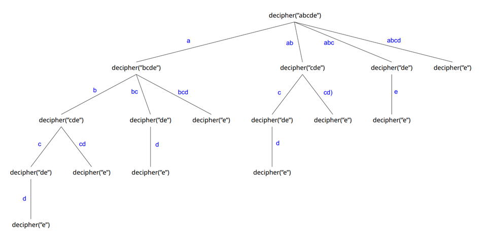
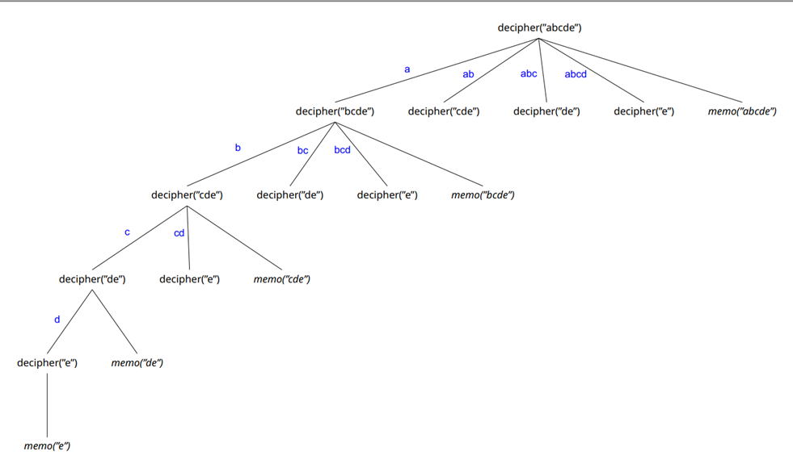

# Sentence Reconstructor 2022

UNYT Algorithms and Complexity, course assignment 02

## Assignment Summary

AlgoNLP – a language processing software company – wants to add a feature that reads a corrupted text block without
spaces or punctuation and then proceeds to return the correctly tokenized text based on the proper dictionary provided.
Moreover, this feature is to be implemented in such a way that it **returns all the potential outcomes** of the
tokenized corrupted text.

### Definition

The algorithm takes as input the corrupted text s and the dictionary D which is a collection of words, and every word w
∈ D contains only alphabetical characters, and specifically contains no spaces or punctuation symbols.

Let d = |D| and n = |s| be respectively the size of input dictionary (in words) and corrupted text (in characters).

### Input Structure Example

Consider the input below.\
**25**\
happyfamiliesareallalikeeveryunhappyfamilyisunhappyinitsownway\
sad\
happy\
family\
families\
all\
one\
any\
are\
is\
their\
way\
in\
own\
all\
none\
alike\
unlike\
a\
like\
every\
each\
any\
unhappy\
its\
his

- first line contains an integer value d such that 0 ≤ d ≤ 5 x 104
- second line contains the corrupted text s, such that its length n = |s| ≤ 103
- the dictionary content follows in the next d lines, each word w is represented in a line and ∀w ∈ D, |w| ≤ 50.

Then the outcome would be:

1. *happy families are all a like every unhappy family is unhappy in its own way*
2. *happy families are all alike every unhappy family is unhappy in its own way*

## Solution Summary

The idea behind the solution of the aforementioned defined problem is based upon the **Dynamic Programming paradigm.**
Hence, in a top-down fashion of DP, in order to decipher(n), - n being the corrupted text as a String of n-characters -
it would necessitate to compute say decipher(n - i), where i represents a valid partition, meaning i is contained in the
dictionary.

In an overview, the program starts from the topmost destination state and afterwards proceeds to compute the solution by
taking into account the values of states that reach the destination state, until the bottom-most base state is reached.

However, as part of the top-down approach, advantage is taken from *memoization optimization.* Once the solution of a
subproblem is computed, it is stored, therefore the next time we might need it again we avoid the computational process
of re-breaking the same words over and over again by simply returning the result from memory.

#### Memoization

Visualizing the power of memoization by using tree representations of a dummy example, we can see that at the first
tree, even though certain subproblems have been solved once, when encountered again, the program would go ahead and
repeat the work in order to solve what was already once solved. Therefore, as an optimization memoization comes to play.

It is quite obvious that even for a problem of this negligible size, where n is 5, the computational work is reduced
noticeably. As it can be seen from this tree in which memoization has been utilized, each suproblem is solved only once,
and then the solution is stored into memory. Whenever the subproblem is encountered again, it is no longer the need to
make additional work for its solutions, but it is rather retrieved from memory in constant access time.

